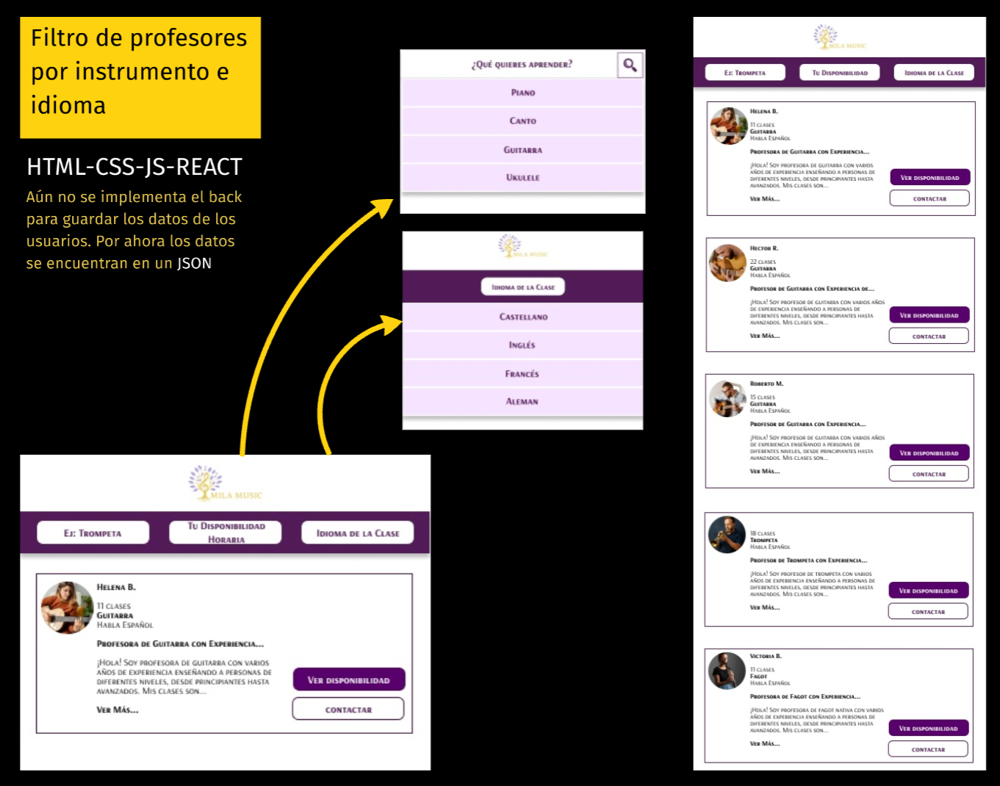
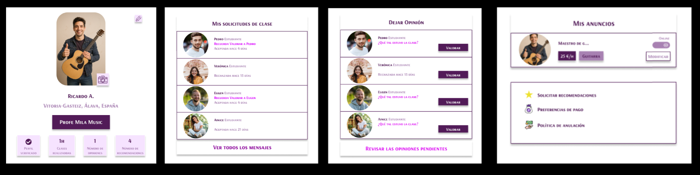
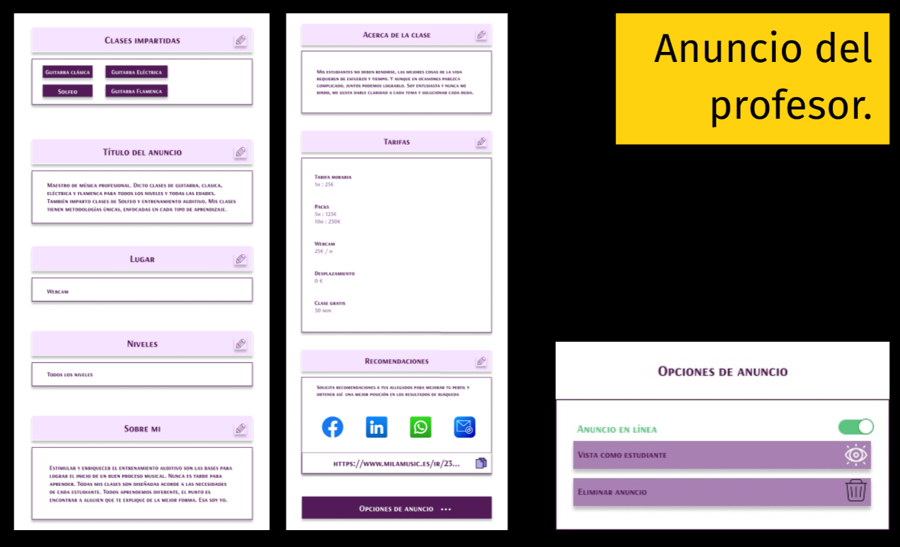

# 🎵 Mila_Music

**Mila_Music** es una plataforma de educación pensada para encontrar el mejor docente de música para cada estudiante, desarrollada con **React**, **Vite** y **Sass**, diseñada para explorar y disfrutar contenido musical de manera interactiva, rápida y moderna.

## 📸 Vistas Generales de la Plataforma

### Vista Principal

---

### Vista del Listado de Docentes

### Área del docente

### Anuncio del docente

---

## 🚀 Características

- 🎧 Navegación fluida entre secciones musicales usando React Router.
- 🎨 Estilos personalizados con Sass para una apariencia moderna y atractiva.
- ⚡ Carga rápida y desarrollo ágil gracias a Vite.
- 📱 Diseño responsivo para todos los dispositivos.
- 🧩 Código modular y escalable.

---

## 📸 Vista previa

Accede a la versión en línea aquí:  
🔗 [Mila_Music en GitHub Pages](https://camila0424.github.io/Mila_Music)

---

## 🛠 Tecnologías utilizadas

- [React](https://reactjs.org/)
- [Vite](https://vitejs.dev/)
- [Sass](https://sass-lang.com/)
- [React Router DOM](https://reactrouter.com/)
- [ESLint](https://eslint.org/)

---

## ⚙️ Instalación y uso

### 1. Clona el repositorio

git clone https://github.com/camila0424/Mila_Music.git
cd Mila_Music

### 2. Instala las dependencias

npm install

### 3. Ejecuta el proyecto en modo desarrollo

npm run dev

### 📂 Estructura del proyecto

Mila_Music/
│
├── public/ <!--# Archivos estáticos                        -->
├── src/ <!--# Código fuente                             -->
│ ├── assets/ <!--# Imágenes, íconos, etc.                    -->
│ ├── components/ <!--# Componentes reutilizables                 -->
│ ├── pages/ <!--# Vistas o páginas                          -->
│ ├── styles/ <!--# Archivos SCSS                             -->
│ └── main.jsx <!--# Punto de entrada                          -->
├── docs/ <!--# Carpeta generada para GitHub Pages        -->
├── vite.config.js <!--# Configuración de Vite                     -->
└── package.json <!--# Configuración del proyecto                -->

## 👩‍💻 Autora

Camila0424
🔗 GitHub

## 📄 Licencia

Este proyecto está bajo la licencia MIT.
Consulta el archivo LICENSE para más detalles.
